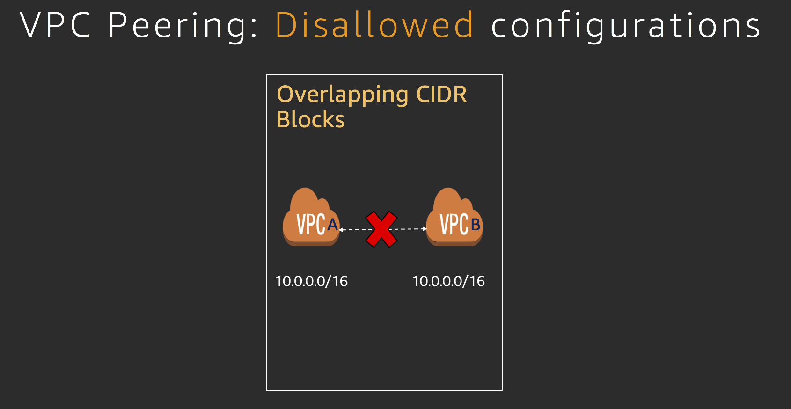

# AWS re:Invent 2018 | NET316-R | Overlapping IP Addresses: How to Tackle VPC Peering

## Introduction

- We often run into a situation where we need to connect two VPCs. [AWS VPC Peering](https://docs.aws.amazon.com/vpc/latest/peering/what-is-vpc-peering.html) is one of the common ways to connect two VPCs

- [AWS VPC Peering](https://docs.aws.amazon.com/vpc/latest/peering/what-is-vpc-peering.html) does not allow certain configuration patterns and overlapping IP address is one of the disallowed pattern. As described in the image below, if two VPCs have same CIDR, they cannot be peered.

- In this session, we will connect two VPCs with overlapping IP addresses by building two solutions:
  1. [AWS PrivateLink](https://aws.amazon.com/privatelink/)
  2. [Software VPN and NAT](https://docs.aws.amazon.com/aws-technical-content/latest/aws-vpc-connectivity-options/software-vpn-amazon-to-amazon.html)
- We then analyze the design tradeoffs of each approach

## Prerequisites:

- Working knowledge of AWS Networking, VPC, Subnetting and Routing
- **Laptop with an administrator access**
- OS X/Linux/Windows are all supported
- Current, up to date, version of Google Chrome or Mozilla Firefox installed
